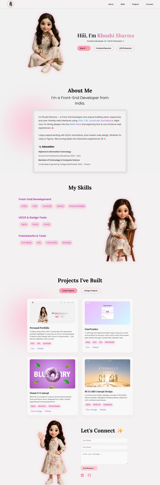
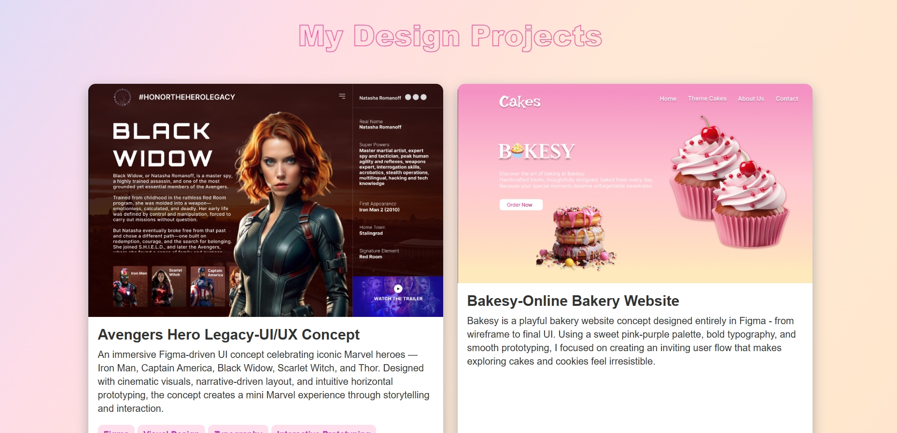
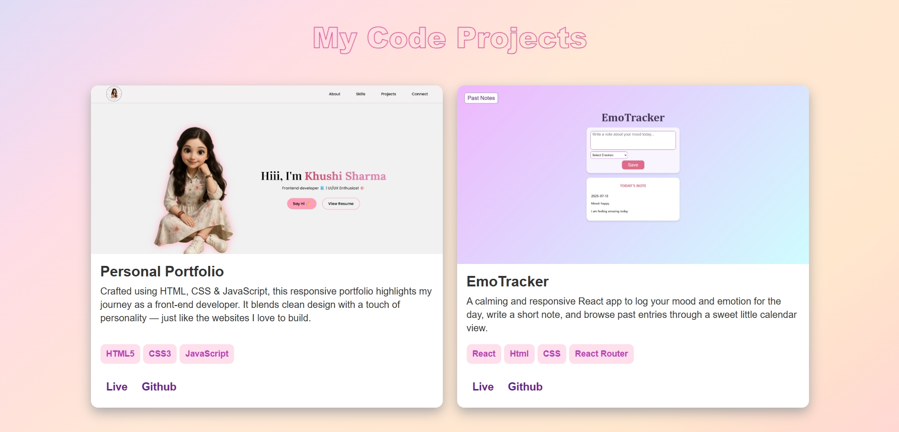

# 🌸 Khushi Sharma — Personal Portfolio  

Welcome to my personal portfolio website!  
Built from scratch using **HTML, CSS, and JavaScript**, this portfolio reflects both my **front-end development skills** and my **love for clean, playful design**.  

[**Live Portfolio →**](https://khushi05sharma.github.io/Personal-Portfolio/)  

---

## ✨ Features

- **Fully responsive design** — smooth viewing on all devices  
- **Interactive and minimal UI** — soft hover effects and animations  
- **Projects showcase** — highlights both coding and design work  
- **Clean and structured layout** — easy navigation for recruiters  
- **Built with love (and a little pink 💖)**  

---

## 🖼 Preview  

| Full Portfolio Preview |
|------------------------|
|  |

| Design Section | Code Section |
|----------------|-------------|
|  |  |

---

## Tech Stack 🛠️

| Category       | Tools Used                        |
|----------------|-----------------------------------|
| 💻 Frontend    | HTML5, CSS3, JavaScript (Vanilla) |
| 🎨 Design      | Flexbox, CSS Grid                 |
| 🎬 Animations  | CSS transitions & hover effects   |
| 📱 Responsive  | Media queries, mobile-first design|

---

## 📌 Sections  

- **Home:** A friendly welcome with quick resume links  
- **About Me:** My journey as a front-end developer  
- **Skills:** Tools and technologies I work with  
- **Projects:** A mix of web apps and UI design concepts  
- **Contact:** Simple form to reach out, plus social links  

---


## Usage 🚀

Simply explore the live site or run locally:

- Click **Say Hi!**, or use the contact form to reach out  
- View live demos or GitHub links for each project  
- Navigate through sections for a tailored glimpse into my skills and screen presence

---

## Future Enhancements 🌱

- Add a blog or journal to share learning experiences  
- Introduce light/dark theme toggle  
- Enhance micro-interactions for increased engagement  
- Transition to a React-based version with improved scalability

---

## License 📜

Distributed under the **MIT License** — feel free to use, adapt, and modify as needed!

---

👩‍💻 About Me

Hi, I’m Khushi Sharma — a Front-End Developer who loves building clean, user-friendly, and creative web interfaces. 
Whether it’s writing HTML/CSS/JS or exploring React, UI/UX design, and animations, I enjoy making ideas come alive on screen.

---

## Installation ⚙️

### To run locally:

```bash
# Clone the repository
git clone https://github.com/khushi05sharma/Personal-Portfolio.git

# Navigate into the project
cd Personal-Portfolio

# Open index.html in your browser (or use Live Server in VS Code)
